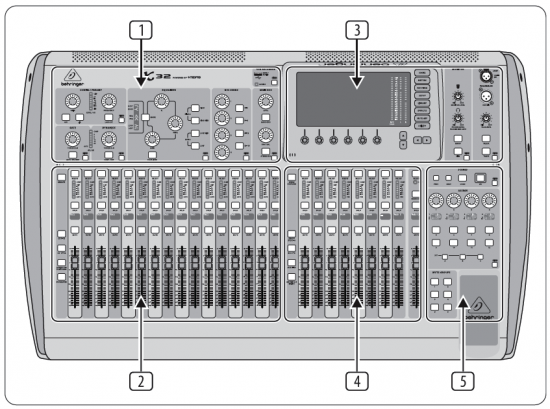
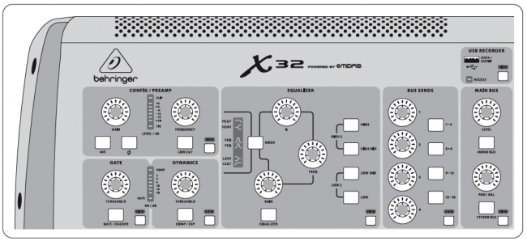
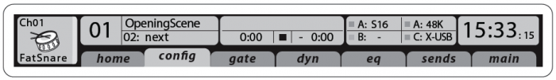
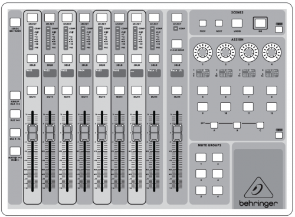
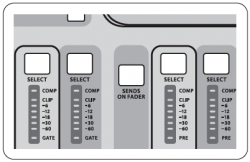
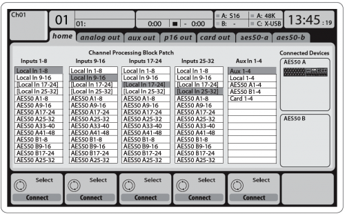
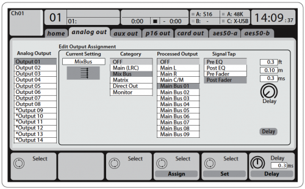
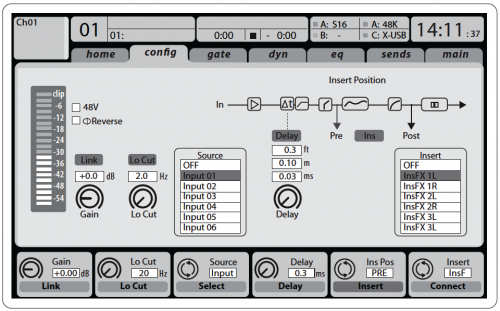
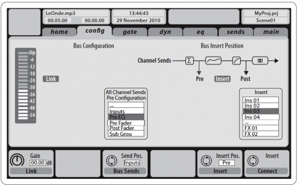

# Operational Overview
## Mixer Operational Overview

This chapter will give you an overview of the basic operations of the mixer, allowing you to get up and running quickly. While reading through the information, we encourage you to experiment with the console’s different screens and controls. The console’s user interface was designed to be extremely to navigate through and learn. More specific details about various functions can be referenced later in the manual.

## General user interface operation

The X32 user interface is divided into five major sections:
1. Channel Strip
2. Input Channels
3. Display and Monitoring
4. Group/Bus/Main Channels
5. Scenes/Assign/Mute Groups

## View buttons rule
Throughout the top panel of the console, you will find small buttons labeled View. Press these buttons to immediately switch the console’s large color display (known as the Main Display) to show information related to the section whose View button you have just pressed.

For example, if you are editing the equalizer and feel like seeing a large display of the EQ frequency response curve or corresponding EQ parameter value, simply press the adjacent View button in the EQ section. If you need to check where the talkback signal is being routed, simply press the View button next to the Talk button and the main display will show the details.

With the View button approach of the X32 console, there is almost never a need to drill down through multiple menu pages, since the View buttons will always take you directly to the relevant screen.

Tip: The Setup/Global tab on the main display allows preferences for the behavior of View and Select buttons to be adjusted.

## Customizing the X32 through the Utilities page
Press the Utility button, located to the right of the main display, to bring up useful functions in a "context-sensitive" manner. For example:

- When you are adjusting the equalizer of a console channel, pressing the Utility button will offer copying, pasting, loading or saving of equalizer settings

- Pressing the Utility button while editing a channel’s Preamp/Configuration screen will present a naming screen where you can customize the channel’s appearance on both the main display as well as the small channel display

- On the Routing pages, pressing the Utility button will offer loading or saving different presets of routing scenarios

- In the Scenes menu, pressing the Utility button offers copying, loading, saving or naming console scenes

## Sometimes there is more to say
Some of the individual pages on the main display contain more adjustable parameters than can be controlled by the 6 rotary push encoders located beneath it. In these cases there is a small page number indication, e.g. "1/2". Simply press the Layer Up/Down buttons to switch between layers.

## Channel Strip

The X32’s channel strip offers dedicated controls for the most important processing parameters of the currently selected channel. To adjust controls for a given channel strip, simply press the Select button on the desired input or output channel.

Certain sections of the channel strip (such as the low cut filter, noise gate, EQ and compressor) contain a respectively labeled button that can be pressed to switch the specific effect on and off. The button illuminates to show the effect is active, and goes dark when bypassed.

Within the channel strip, the rotary control knobs are surrounded by an amber LED collar that indicates the parameter’s value. Whenever this backlit knob is turned off, it indicates that this specific control/parameter is not available for the selected channel type. For example, if an output bus is currently selected, the LED collar and the gain knob are turned off, because there is no input gain to be controlled on an output bus.

The channel strip consists of the following sub-sections:
- Config/Preamp
- Gate, Dynamics
- Equalizer
- Bus Sends, Main Bus

Each of these subsections correspond to the processing steps of the currently selected channel, and they each have their own View button that, when pressed, switches the Main Display to a page displaying all related parameters for that subsection.

## Input Channel Banks
You will find a select button on top of every channel that is used to direct the control focus of the user interface, including all channel related parameters (channel strip and main display), to that channel. Please note that at any time, there is exactly one channel selected (either Input Ch 1-32, Aux 1-8, FX Returns 1L-4R, Mix Bus 1-16, Main LR/C, or Matrix 1-6). DCA Groups (digitally controlled amplifier) cannot be selected because they control a number of assigned channels rather than one specific channel.

The Input Channels section of the console is located on the left hand side, and offers 16 separate input channel strips. These 16 channel strips represent three separate layers of inputs for the console, including:

- Input Channels 1-16

- Input Channels 17-32

- Auxiliary Inputs 1-6/USB playback/FX Returns 1L-4R

Press any of the correspondingly labeled layer buttons on the left side of the console to switch the input channel bank to any of the three layers listed above. The button will illuminate, reminding you which layer is active.

A fourth layer (Bus Masters) is also offered, allowing you to adjust the levels of the 16 Mix Bus Masters, which is useful when you wish to include Bus Masters into DCA Group assignments.

On each fader strip you will find a motorized 100 mm level fader, Mute and Solo buttons, a Gate indicator, an input level meter, Compressor indicator, and the channel select button.

Each of the 16 input channels has an individual (and customizable) color LCD screen that can display a channel number, nickname, and even a graphical channel icon. In the event that a channel’s input source has been changed to an input signal that differs from the default setup, the LCD display will also indicate the name of the actual input source.

Example: Channel 01 has the nickname Soundcard and is fed from Aux input 5.

## Main Display Area

The main color display presents information about various sections of the console. It can be switched to different screens using the console’s View buttons, as well as any of the 8 buttons on the right side of the display.

The top section of the main display permanently covers useful status information. The top left corner shows the selected channel number, its nickname and the selected icon. The next block shows the current scene number and name in amber, as well as the next upcoming scene. The center section displays the playback file name along with elapsed and remaining time and a recorder status icon. The next block to the right has 4 segments to show the status of AES50 ports A and B, the Card slot and the audio clock synchronization source and sample rate (top right). Small green square indicators show proper connectivity. The right most block shows the console time that can be set under Setup/Config.

When working with any given screen, press the Page keys located on the display bezel to switch to different screen pages.

Editing parameters or settings on each of the screens is done using the 6 associated push-encoders along the bottom edge of the display.

- Whenever there is a continuous control or list entry, you can turn the corresponding knob for editing, which is indicated by various circular icons

- When there is a switch or toggle function on one of these knobs, you will see a broad rectangular button along the lower edge of the field. Pressing the encoder changes the on/off state of the corresponding function. When the rectangular button in the display is dark grey, the corresponding function is off/inactive; when it is amber, the function is on/active

## Monitoring and Talkback
There are two separate Level controls in this section, one for the headphone outputs located on either side of the console, and a second one for the monitor outputs located on the rear panel.

Press the section’s View button to edit various monitoring preferences, such as the input source for the phones bus and the monitor outputs.

This section also contains independent Talkback buttons (A and B). Press the View button to edit the Talkback preferences for the Talkback A path and Talkback B path separately. This screen also contains settings for the optional goose-neck lamp and the console’s internal test-tone generator.

## Group/Bus Channel Banks

This section of the console offers eight channel strips, divided into the following layers:
- Eight DCA (digitally controlled amplifier) groups
- Mix Bus masters 1-8
- Mix Bus masters 9-16
- Matrix Outputs 1-6, and the main center bus

This section also contains a main LR output fader, which is independent and always available no matter which channel bank or layer is active.

When using the DCA Groups layer, the DCA Groups can be soloed and muted, but they cannot be selected. To edit the DCA group names, icons and colors, navigate to the Setup/DCA Groups page on the main display.

When using any of the output bus layers, note that the bottom LEDs on the meters in this section illuminate when the respective bus is fed from pre-fader sources of the selected channel.

## Various Assignments (DCA groups, mute groups, custom assignable controls)

### Assigning DCA Groups
Thanks to the two distinct fader groups (inputs on the left, outputs on the right), the task of assigning channels or buses to a virtual DCA Group is a breeze on the X32. Simply hold the respective DCA Group Select button on the right-hand side of the console, while pressing the select buttons for all the input channels that you wish to assign to said DCA Group. You can also press the DCA Group Select button in order to check which channels are already assigned to it. The assigned channel Select buttons will light up.

### Assigning Mute Groups
The mute group assignment process is similar to the above, but is designed with an additional precaution in order to prevent accidental muting of channels during a show. To assign input/output channels to one of the six mute groups (controlled by the buttons located to the right of the Main LR fader) you need to first switch on the Mute Grp button next to the main display. While holding the desired Mute Group button, select the desired input and output channels, which will now be assigned to the Mute Group. When you are done with assignment, switch off Mute Grp at the display, and the 6 Mute Group buttons will work as intended.

### Custom Assignable Controls
The Assign section of the console offers three banks: A, B, and C. Each set of controls offers 4 rotary controls and 8 switches/buttons, allowing for freely customizable access to 36 random functions on the X32.

To make a custom assignment:
- Press the View button in the Assign section to edit the assignments
- Select the set of controls you wish to edit (A, B or C)
- Select the control 1-12 you wish to assign
- Select the parameter you wish to control and assign the function

Usually this is used to control a specific channel’s parameter, like the lead vocalist’s reverb send level.

The Jump-to-Page control is a special target type that does not alter any audio parameter, but rather brings you directly to any specified display page. Buttons that had been used for Jump-to-Page previously can easily be reassigned to the current display view by holding the respective set button (A, B or C) depressed while pushing the desired assignable button. This method is more convenient than reassigning the jump function through the Assign menu.

## The "Sends on Faders" Function

The X32 console features a very useful function that can be accessed by pressing the dedicated Sends on Faders button, located between the two fader sections.

The Sends on Faders function aids with level setting of channels sent to any of the 16 Mix Buses. It is only for channels assigned to Mix Buses 1-16, and does NOT work for DCA groups, main or matrix buses. The Sends on Faders function works in two convenient ways to cover the most obvious situations in a live sound environment:

- When preparing a monitor mix for a specific musician
    - Select the monitor bus (1-8, 9-16) that feeds the talent’s stage monitor

    - Press the Sends on Faders button; it will illuminate

    - Select one of the three input channel layers (CH 1-16, CH 17-32, Line-Aux/FX Ret)

    - As long as the Sends on Faders is active, all faders in the input channels section (located on the left side of the console) correspond to the send levels to the selected (monitor) mix bus
- When checking/editing where a selected input signal is (to be) sent to
    - Select the input channel in the left section

    - Press the Sends on Faders button; it will illuminate

    - Select either bus channel layer 1-8 or 9-16

    - The bus faders (located on right side of the console) now represent the send levels from the selected input channel (located on the left side of the console)

The option to use Sends on Faders in both ways, selecting an input or an output channel, is a special feature of the X32.

## Routing I/O

The X32 console features 32 analog rear-panel XLR inputs with microphone-preamps, as well as 16 rear-panel XLR Outputs and 6 TRS Aux Sends and Returns. In addition, there are two AES50 ports, each featuring 48 input and output channels, and a card slot for 32 channels of input and output to and from a connected computer via USB 2.0.

Input Signals can be attached to the console’s internal audio processing engine in blocks of 8 signals from any one of the aforementioned input sources.

Note: All signal blocks patched to the audio processing will be connected to the corresponding input channels automatically.

### Output Signals

Output Signals can be freely assigned from any internal signal to any of the following outputs:
- 16x analog local XLR outputs (with adjustable digital delay for time-alignment of speakers)
- 6x auxiliary sends on ¼" TRS outputs + 2x AES/EBU outputs
- 16x personal monitoring using the console’s P-16 Bus output connector

Any and all of the above signals can also be mirrored in blocks of 8 signals on either one of
- 48x channels on AES50 port A
- 48x channels on AES50 port B
- 32x channels on USB interface card

## Input Channels

Input Channels 1-32 are pre-configured to use the first 32 input signals, but can be patched to use any other available signal on the audio engine as well, including mix bus/sub group outputs. Changes of the Channel Source can be made on the Preamp

## Aux Return Channels
Aux Return Channels 1-8 are pre-configured to use the 6 aux input signals, and the two USB playback outputs, but can be patched to use any other available signal of the console as well.

## FX Return Channels
FX Return Channels 1L-4R control the 4 stereo output signals of side-chain FX1-4.

## The configuration of Mix Bus Channels

The configuration of Mix Bus Channels 1-16 can be pre-set (in the Setup/Global page) or can also be configured on an individual, per-channel basis. The bus processing includes (in this order):
- Insert point (swappable between post-EQ and pre-EQ operation)
- 6-band fully parametric EQ
- Compressor/expander (swappable between post-EQ and pre-EQ operation)
- Bus sends to 6 matrices
- Main LR panning
- Mono/Center level

## Main Bus Channels 
Main Bus Channels LR/C are always available and independent from Mix Buses. The processing steps for this signal path include (in this order):

- Insert point (swappable between post-EQ and pre-EQ operation)
- 6-band fully parametric EQ
- Compressor/expander (swappable between post-EQ and pre-EQ operation)
- Bus sends to 6 matrices

## Matrix Channels
Matrix Channels 1-6 are fed exclusively by MAIN LRC and Mix Bus 1-16 signals. The processing steps include (in this order):
- Insert point (swappable between post-EQ and pre-EQ operation)
- 6-band fully parametric EQ
- Compressor/expander (swappable between post-EQ and pre-EQ operation)

## Effects Processing 1-8
The X32 console contains eight true-stereo internal effects engines.
- FX 1-4 can be configured as side chain or insert effects, while FX 5-8 can only be used in insert points of channels or buses
- The returns of side chain FX 1-4 can always be controlled using the 3rd bank (layer) of the input channels - Aux/USB/FX Returns. Note that the return signals of FX 1-4 have separate faders for left and right
- The FX Home screen allows selection of the FX 1-4 input sources and selecting the effects type/algorithm for each of the 8 FX slots of the virtual rack
- The subsequent tabs FX 1-FX 8 of the FX screen allow editing all parameters of the chosen effects processor

## X32 Tablet App

Many functions of the X32 console can be remotely controlled by a dedicated iPad/Android app. Details about the app's download, setup and operation are available on the X32 product page.

The app's User Interface is optimized for the touchscreen nature of the iPad and concentrates on the most important remote features of the console. Using the app, you can perform functions such as adjusting monitor mixes from the stage while interacting with musicians, or adjusting the front-of-house mix from the audience, while hearing the mix exactly as the audience does.

## X32 Windows/OS X/Linux Application

Also offered is a separate remote editor running on host computers that will allow for complete editing control of the X32 via Ethernet. Check out behringer.com for more information.

Tip: The X32 remote communication is OSC-based (open sound control) and we will share the protocol on our website, allowing developers to design their own control software. Stay tuned to behringer.com for details on the OSC protocol.

## X-USB expansion card
The X-USB card allows transmission of up to 32 channels to and from a connected computer. Please download the X-USB drivers and Quick Start Guide from behringer.com before connecting the mixer to your computer.

Note - the first X32 production units shipped with the X-UF FireWire/USB card. See the "USB Interface Operation Guide" for details.

## Startup and Shutdown, and Update
We recommend switching the X32 mixer on first, and shutting it off last when any sound system is connected. This will prevent the possibility of any unexpected noises being transmitted during the startup/shutdown process.

The Setup screen’s general preference page contains a Safe Main Levels function. When activated, the console automatically mutes the main LRC levels when booting the console. It also prevents any scene loading from affecting (i.e. turning up) the mains levels.

Synchronization and Sample Rate settings for the console can be adjusted on the Setup/Config page, but please note that sample rate changes will require a reboot of the console. When you see a red square indication at the top section of the main display, please verify if the synchronization settings on Setup/Config make sense (see section 3).

If the console has been used by someone else, and you feel unsure about its specific routing status, you can reset the X32 to default settings in two convenient ways:
- While the console is booting and the "X32" logo appears on the screen, press and hold the Scenes/Undo button until the console is fully operational and the Home screen is displayed. The console will now be in the same state as it was when shipped from the factory. However, you can immediately revert to the status the console was in when being switched off the last time by pressing the Scenes/Undo button
- You can also reset the console any time after booting by pressing Setup/Config, then Initialize

NOTE: Initializing the console does not automatically erase the current show data or any stored scenes. If you wish to clear all scenes, please use the ’Initialize All Show Data’ option on Setup/Config page.

In order to prevent any errors by losing power during a store operation, we recommend using the "Safe Shutdown" function from the Setup/Global page.

NOTE: The X32 can be locked against unintended use by activating ’Lock Console’ from the Setup/Global page. In this state the UI will not allow any changes to be made and the display shows "X". Keep HOME depressed for about 5 seconds to unlock the X32 again.

The X32 firmware can easily be updated by performing the following steps:
- Download the new console firmware from the X32 product page onto the root level of a USB thumb drive
- Plug the USB thumb drive into the top panel USB connector while the console is turned off
- Hold the USB View button depressed while switching the console on. While booting, the X32 will run a fully automatic firmware update, which will take 2-3 minutes longer than the regular boot sequence

When no update file is available on the USB drive, or when it is corrupted, the update mode will remain active, preventing the X32 from booting regularly. Switch the console off and back on without holding the USB View button to boot the console with the existing firmware.

CAUTION: Please do not block the fan opening on the bottom of the X32 cabinet! The large slow-turning fan is barely audible, but it is still working. Specifically when mounting the X32 in a road case, please ensure there is sufficient space underneath to allow for some airflow.
