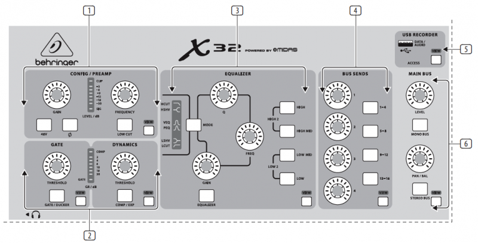

# Channel Strip

## 1. Preamp
Adjust the preamp gain for the selected channel with the Gain knob. Press the 48 V button to apply phantom power for use with condenser microphones and press the button to reverse the channel’s phase. The meter displays the selected channel’s level. Press the Low Cut button and select the desired high-pass frequency to remove unwanted lows. Press the View button to access more detailed parameters on the Main Display. Note - It is best practice to mute the respective channels prior to switching their phantom power supply on or off. Otherwise, the change of charge may cause an audible popping noise. Gain adjustments might also produce audible click noise when adjust shortly after having switched phantom power on or off.

## 2. Gate/Dynamics
Press the Gate/Ducker button to engage the noise gate and adjust the threshold accordingly. Press the Comp/Exp button to engage the compressor and adjust the threshold accordingly. When the signal level in the meter drops below the selected Gate threshold, the noise gate will silence the channel. When the signal level reaches the selected Dynamics threshold, the peaks will be compressed. Press the View buttons to access more parameters on the Main Display.

## 3. Equalizer
Press the Equalizer button to engage this section. Select one of the 4 frequency bands with the High, High Mid, Low Mid, and Low knobs. Press the Mode button to cycle through the types of EQ available. Select the specific frequency to be adjusted with the Freq knob, and adjust the bandwidth of the EQ with the Q knob. Finally, boost or cut the selected frequency with the Gain knob. Press the View button for more editing options.

## 4. Bus Sends
Quickly adjust the bus sends by selecting one of the 4 banks, followed by one of the 4 knobs. Press the View button for more detailed editing and routing.

## 5. USB Recorder
Connect a thumb drive to install firmware updates and to record performances. See the Topic Guide section for details.

## 6. Main Bus
Press the Mono Bus or Stereo Bus to assign the channel to the main mono or stereo bus. When Stereo Bus is selected, the Pan/Bal adjusts the left-to-right positioning. Adjust the overall send level to the Mono Bus with the Level knob. Press the View button for more editing options.