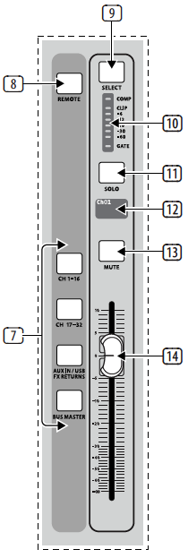

# Input Channel Banks

## 7. Layer Select
Select either the channels 1-16, channels 17-32, Aux In/USB/FX Returns, or Bus Masters layer with these 4 buttons. The currently active layer will light.

## 8. DAW Remote
Press this to enable DAW remote control.

## 9. Select
Press this button to select an input or bus (depending which layer is active) and allow it to be edited by the Channel Strip and Main Display.

## 10. Channel Meter
This displays the signal level of the input or bus (depending which layer is active). The Gate and Comp LEDs light to indicate that noise gate and/or compression are active.

## 11. Solo
Press this button to send the channel to the Solo Bus.

## 12. Mini Display
Information such as channel number, nickname, input source and graphical icon are displayed on this color LCD screen.

## 13. Mute
Press this button to mute the channel.

## 14. Fader
Use this to adjust the channel volume or bus send in ’Sends on Faders’ mode. The faders will automatically display the current status as layers and functions are changed.