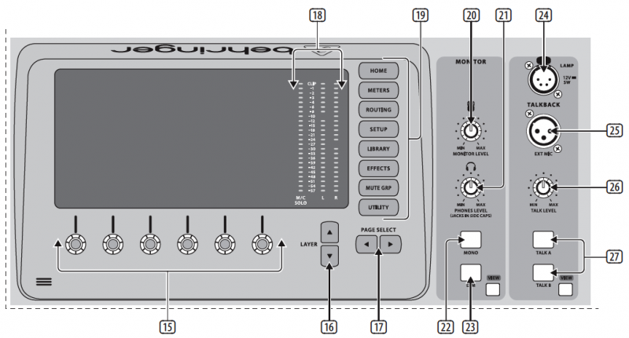

# Display and Monitoring

## 15. Push Encoders
These 6 controls adjust the parameters presented at the bottom of the Main Display. The editable function will show a circular icon in the display when continuous control is available. The function will show a broad rectangular icon to indicate that a switch or toggle can be accessed by pushing the encoder.

## 16. Layer Buttons
Some screens in the Main Display have more than 6 editable parameters which can be accessed by pressing the Layer Up or Down buttons.

## 17. Page Select Buttons
Use these to scroll through the available screens or to confirm/decline certain actions.

## 18. Main/Solo Meters
The main stereo output level is displayed here along with the solo level of all channels whose Solo button is active.

## 19. Category Select Buttons
Press one of these buttons to jump directly to the subject you wish to edit or configure.

## 20. Monitor Level
Adjust the level of the Monitor outputs with this knob.

## 21. Phones Level
Adjust the volume of the headphone outputs, located inside the left and right side caps.

## 22. Monitor Mono
Press this button to monitor the audio in mono.

## 23. Dim
Press this button to reduce the monitor volume. Press the View button to adjust the amount of attenuation along with all other monitoring-related functions.

## 24. Lamp Input
Connect a standard 12 V, 5 Watt gooseneck lamp here.

## 25. Talkback Input
Connect a talkback mic via standard XLR cable to this input.

## 26. Talk Level
Adjust the level of the talkback mic with this knob.

## 27. Talk A/B
Select the destination for the talkback mic signal with these buttons. Press the View button to edit the talkback routing for A and B.